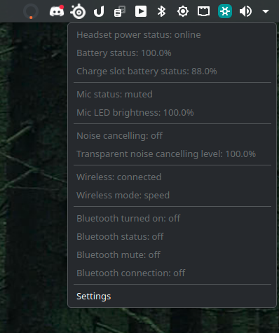
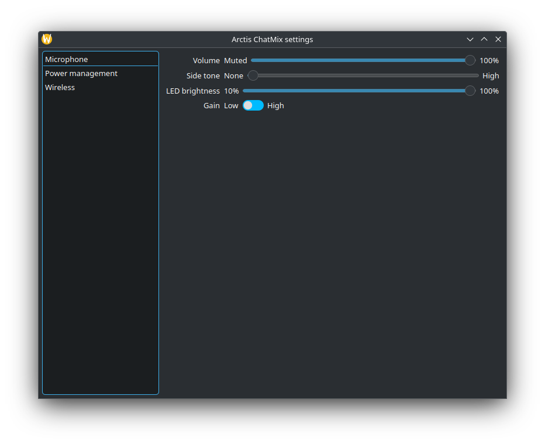

# Linux-Arctis-ChatMix

## Important Licensing Notice

`Linux-Arctis-Chatmix` is under the GPLv3 license. While the GPL license does permit commercial use, it is **strongly discouraged** to reuse the work herein for any for-profit purpose as it relates to the usage of a third party proprietary hardware device.

## Overview
The SteelSeries Arctis series of headsets include a hardware modulation knob for 'chatmix' on the headset and, in some models, have a DAC hardware doing the same. This allows the user to 'mix' the volume of two different devices on their system, named "Game" and "Chat".

On older Arctis models (e.g. Arctis 7), the headset would be detected as two individual hardware devices by the host operating system and would assign them as such accordingly, allowing the user to specify which device to use and where.

**Typical use case:** "Chat" for voicechat in games and VOIP/comms software, and "Game" for system / music etc.

On the Arctis 7+ model (and others), this two-device differentiation no longer exists, and the host OS will only recognize a single device. If the user wishes to utilize the chatmix modulation knob, he/she *must* install the SteelSeries proprietary GG software, which is not available on Linux nor can be executed for example via Wine.

This script provides a basic workaround for this problem for Linux users. It creates two different virtual Audio/Sink PulseAudio node, called "(DEVICE NAME) Game"
and "(DEVICE NAME) Chat" respectively, that the user can then assign indipendently to his/her applications.

The application then listens to the headset's USB dongle signals and interprets them in a way that can be meaningfully converted to adjust the audio when the user moves the dial on the headset.

## Install

### Requirements

The software is based on the following prerequisites:

- Python 3.9+
- Python modules (they will be installed automatically by the `install.sh` script)
  - Locally installable (via `pip install --user`) Python modules (prompt will ask if you want to install them locally):
    - [PyUSB](https://pyusb.github.io/pyusb/) - USB communication library
    - [qasync](https://github.com/CabbageDevelopment/qasync) - seamless async integration with Qt applications
  - Globally (via package manager) or locally (via `pip install --user`) installable Python modules (prompt will ask accordingly)
    - [PyQt6](https://www.riverbankcomputing.com/software/pyqt/) (suggested: globally due to its size) - Qt6 bindings for UI parts
- PulseAudio (very common in modern Linux distributions)

**Note**
Do not install any python module globally, never (i.e. using `sudo pip install ...`), it might break your linux distribution!

### Execution

In order to install the application, simply run `./install.sh` (as user, not as root). In order to uninstall, prepend `UNINSTALL= `, i.e. `UNINSTALL= ./install.sh`.

The following subsystems will be installed:
- udev rules to set the ownership of the `/dev` device and to create a `/dev/arctischatmix` symlink to trigger the service (see below). The ownership part is not perfect for multi-users setups, but I'm working on it.
- user space's systemd service, which starts up at device plugin (or user's login) and shuts down at device plug-out (or user's log off).
- the Python application, including the service which communicates to the device, and a system tray icon which will display all the available information. If any setting is configurable software-side, the system tray app will show the relative action to open the settings menu.

## Screenshots

### System tray application

### Settings window (in the example: Arctis Nova Pro Wireless)

**Note**: your device should automatically be configured after installation. If not, please unplug and plug the device again.

## Supported devices

- **Arctis 7+** (original development by [birdls](https://github.com/birdybirdonline))
  - Variants: PS5, XBOX, Destiny (only name and device id are changed)
- **Arctis Nova Pro Wireless** (developed by [Giacomo Furlan](https://github.com/elegos)). Note: the PulseAudio's channel's volume will stay at 100% even turning the knob, because it is managed by the GameDAC gen2 directly, so applying an audio reduction would apply it twice.
  - Variants: X (name and device id changed)

## How to add the support to a new device

The software has been rewritten from scratch from the original project to have an underlaying framework, in order to allow developers easily add new devices to the support list.

In order to support a new device you need to:

- add a new set of rules in [system-config/91-steelseries-arctis.rules](system-config/91-steelseries-arctis.rules) -> if having troubles with udev selector with composite USB devices, you might start from `udevadm info --attribute-walk --name=/dev/input/by-id/usb-SteelSeries_Arctis_[your specific device here]`. Take a look at the Nova Pro Wireless's rules to get an idea.
- Add a new [DeviceManager](arctis_chatmix/device_manager/device_manager.py) and its relative [DeviceStatus](arctis_chatmix/device_manager/device_status.py) in [arctis_chatmix/devices/](arctis_chatmix/devices/). Read the [Arctis Nova Pro Wireless](arctis_chatmix/devices/device_arctis_nova_pro_wireless.py) definition to get the idea.
- Update the [lang/](lang/) json files, if you introduced new `DeviceStatus` attributes and/or values. By default untranslatable items will go untranslated.

The new device will automatically be registered for you in the application.

If your work does the job, consider forking the repository and open a pull request.

Important notes:

- when working on the repository and running the application for debugging, remember to stop the service via `systemctl --user disable --now arctis-pcm.service`. Once finished, you can enable it again via `sysetmctl --user enable arctis-pcm.service`.
- if working with vscode, a launch setup is ready to use (`arctis_chatmix debug`) which will run the software with debug logging
- remember to refresh your installation once finished (see installation section)

### Do I need to override the `DeviceManager.init_device` for my new device?

It really depends. In my experience yes, if you have a GameDAC. If your device uses a GameDAC v2, it is possible that you can simply copy the Arctis Nova Pro Wireless method, which essentially enables the (otherwise missing) mixer functionality. The packets sent by that manager have been recorded using WireShark listening on the USB interface and I'm unsure whether all of them are required or not. If one or more features are missing to your device, you will probably need to tinker with Wireshark (or similar) listening on the USB interfaces and try to figure it out.

# Acknowledgements

Thanks to:
- [birdls](https://github.com/birdybirdonline/) for the [original project](https://github.com/birdybirdonline/Linux-Arctis-7-Plus-ChatMix).
- [Wander Lairson Costa](https://github.com/walac), [mcuee](https://github.com/mcuee) and [Jonas Malaco](https://github.com/jonasmalacofilho) for the [PyUSB](https://github.com/pyusb/pyusb) library

## Need support?

Don't hesitate to [open an issue](https://github.com/elegos/Linux-Arctis-ChatMix/issues). Please include as many details as possible, for example the otuput of `journalctl -b -f -u systemd-udevd`.
